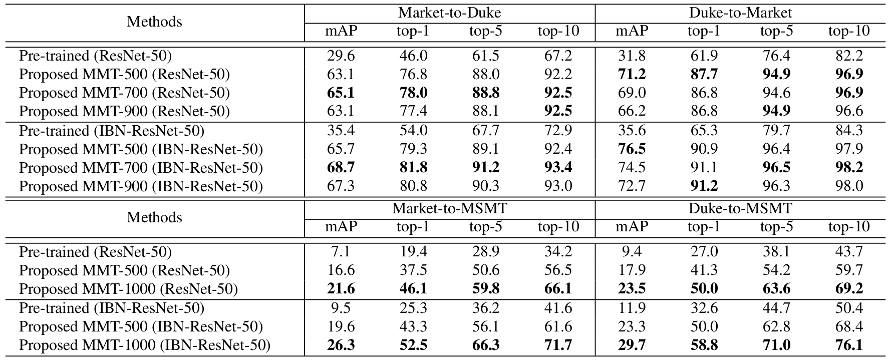

# Mutual Mean-Teaching (MMT)

The source code for the ICLR-2020 submission
[Mutual Mean-Teaching: Pseudo Label Refinery for Unsupervised Domain Adaptation on Person Re-identification](https://openreview.net/forum?id=rJlnOhVYPS).


**Please note that**
+ It is a *pre-released* repository for the anonymous open-review process.
+ Trained models are partially hidden for the knowledge protection.
+ The *official* repository containing full training code and all trained models will be available upon the paper published.


## Installation

```shell
git clone https://github.com/Pre-release/MMT.git
cd MMT
python setup.py install
```

## Prepare Datasets

```shell
cd example && mkdir data
```
Download the raw datasets [DukeMTMC-reID](https://arxiv.org/abs/1609.01775), [Market-1501](https://www.cv-foundation.org/openaccess/content_iccv_2015/papers/Zheng_Scalable_Person_Re-Identification_ICCV_2015_paper.pdf), [MSMT17](https://arxiv.org/abs/1711.08565),
and then unzip them under the directory like
```
MMT/example/data
├── dukemtmc
│   └── DukeMTMC-reID
├── market1501
│   └── Market-1501-v15.09.15
└── msmt17
    └── MSMT17_V1
```

## Prepare Pre-trained Models
When *training with the backbone of [IBN-ResNet-50](https://arxiv.org/abs/1807.09441)*, you need to download the [ImageNet](http://www.image-net.org/) pre-trained model from this [link](https://github.com/XingangPan/IBN-Net#testing) and save it under the path of `logs/pretrained/`.
(The python script could download the ImageNet pre-trained model for [ResNet-50](https://arxiv.org/abs/1512.03385) directly.)
```shell
mkdir logs && cd logs
mkdir pretrained
```
The file tree should be
```
MMT/logs
└── pretrained
    └── resnet50_ibn_a.pth.tar
```

## Example #1:
Transferring from [DukeMTMC-reID](https://arxiv.org/abs/1609.01775) to [Market-1501](https://www.cv-foundation.org/openaccess/content_iccv_2015/papers/Zheng_Scalable_Person_Re-Identification_ICCV_2015_paper.pdf) on the backbone of [ResNet-50](https://arxiv.org/abs/1512.03385), *i.e. Duke-to-Market (ResNet-50)*.

### Train
We utilize 4 GTX-1080TI GPUs for training.

#### Stage I: Pre-training on the source domain
Note: the pre-training code for source domain will be available in the official repository.
```shell
sh scripts/pretrain.sh dukemtmc market1501 resnet50 1
sh scripts/pretrain.sh dukemtmc market1501 resnet50 2
```

#### Stage II: End-to-end training with MMT-500

```shell
sh scripts/train.sh dukemtmc market1501 resnet50 500
```

### Test
We utilize 1 GTX-1080TI GPU for testing.
You could test your trained models with best performance or directly download the ResNet50-MMT-500 model for Duke-to-Market task [here](https://drive.google.com/open?id=1gtv_jjtRfFXaygznHh24SmXLX7inEaG8).
```shell
sh scripts/test.sh market1501 resnet50 logs/dukemtmcTOmarket1501/resnet50-MMT-500/model_best.pth.tar
```

## Other Examples:
**Duke-to-Market (IBN-ResNet-50)**
```shell
# pre-training on the source domain
sh scripts/pretrain.sh dukemtmc market1501 resnet_ibn50a 1
sh scripts/pretrain.sh dukemtmc market1501 resnet_ibn50a 2
# end-to-end training with MMT-500
sh scripts/train.sh dukemtmc market1501 resnet_ibn50a 500
# or MMT-700
sh scripts/train.sh dukemtmc market1501 resnet_ibn50a 700
# testing the best model
sh scripts/test.sh market1501 resnet_ibn50a logs/dukemtmcTOmarket1501/resnet_ibn50a-MMT-500/model_best.pth.tar
sh scripts/test.sh market1501 resnet_ibn50a logs/dukemtmcTOmarket1501/resnet_ibn50a-MMT-700/model_best.pth.tar
```
**Duke-to-MSMT (ResNet-50)**
```shell
# pre-training on the source domain
sh scripts/pretrain.sh dukemtmc msmt17 resnet50 1
sh scripts/pretrain.sh dukemtmc msmt17 resnet50 2
# end-to-end training with MMT-500
sh scripts/train.sh dukemtmc msmt17 resnet50 500
# or MMT-1000
sh scripts/train.sh dukemtmc msmt17 resnet50 1000
# testing the best model
sh scripts/test.sh msmt17 resnet50 logs/dukemtmcTOmsmt17/resnet50-MMT-500/model_best.pth.tar
sh scripts/test.sh msmt17 resnet50 logs/dukemtmcTOmsmt17/resnet50-MMT-1000/model_best.pth.tar
```


## Download Trained Models

*We will provide all models in the official repository.* 

## Citation
If you find this code useful for your research, please cite our paper
```
@inproceedings{
anonymous2020mutual,
title={Mutual Mean-Teaching: Pseudo Label Refinery for Unsupervised Domain Adaptation on Person Re-identification},
author={Anonymous},
booktitle={Submitted to International Conference on Learning Representations},
year={2020},
url={https://openreview.net/forum?id=rJlnOhVYPS},
note={under review}
}
```
